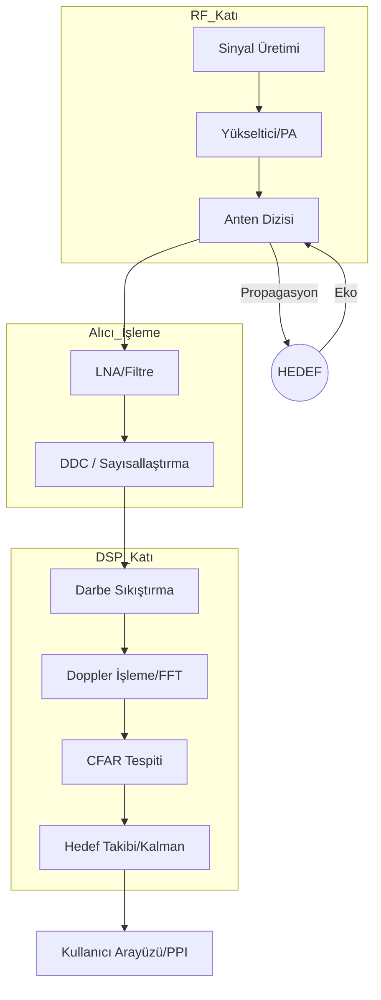

# 📡 Radar Sistemleri El Kitabı (`radar-sistemleri-el-kitabi`)

[](https://opensource.org/licenses/MIT)
[]()
[]()
[]()
[]()

> "Görünmeyeni Görmek, Bilinmeyeni Ölçmek. Elektromanyetik Spektrumun Hakimi Olmak."

Bu depo, radar mühendisliği alanına ilgi duyan öğrenciler, savunma sanayii profesyonelleri ve sistem mimarları için hazırlanmış **Türkçe, akademik derinliği olan ve uygulamalı** bir dijital külliyattır. Proje, temel fizik prensiplerinden başlayarak modern AESA radar sistemlerine kadar uzanan geniş bir yelpazeyi kapsar.

---

## 🎯 Projenin Vizyonu ve Misyonu

Radar sistemleri, modern savunma ve sivil teknolojilerin (otonom sürüş, hava trafik kontrolü, uzay gözlemleri, meteoroloji) kalbinde yer alır. Bu projenin temel amacı:
*   **Karmaşık Teoriyi Basitleştirmek:** Elektromanyetik dalga yayılımı ve sinyal işleme algoritmalarını anlaşılır kılmak.
*   **Uygulamalı Öğrenim:** Teorik bilgiyi Python ve MATLAB simülasyonları ile desteklemek.
*   **Yerli Literatür:** Türk savunma sanayii ekosistemine nitelikli Türkçe kaynak kazandırmak.

---

## 📊 Radar Sistemlerinin Sınıflandırılması

Aşağıdaki tablo, radar sistemlerinin kullanım amaçlarına ve teknik özelliklerine göre genel bir sınıflandırmasını sunar:

| Kriter | Radar Türü | Temel Özellik / Kullanım Alanı |
| :--- | :--- | :--- |
| **Dalga Formu** | **Darbeli (Pulsed)** | Yüksek güç, uzun menzil tespit. |
| | **Sürekli Dalga (CW/FMCW)** | Otonom araçlar, altimetreler, yakın menzil. |
| **Platform** | **Yer Konuşlu** | Hava savunma radarları, ATC. |
| | **Gemi/Uçak Konuşlu** | Atış kontrol, arama ve kurtarma. |
| **İşlev** | **Arama Radarı** | Geniş alan tarama, erken uyarı. |
| | **Takip Radarı** | Yüksek hassasiyetli hedef kilitleme. |
| **Anten Yapısı** | **Mekanik Taramalı** | Dönen anten yapıları. |
| | **Elektronik Taramalı (AESA/PESA)** | Hızlı hüzme yönlendirme (Beamsteering). |

---

## 📖 Eğitim Modülleri: Teknik Derinlik ve İçerik

Bu el kitabı, birbirini takip eden 5 ana teknik modülden oluşmaktadır:

### 🔬 Bölüm 1: Radar Temelleri ve Elektromanyetik Teori
*   **EM Dalga Yayılımı:** Maxwell denklemleri, yansıma, kırılma ve atmosferik absorbsiyon.
*   **Radar Denklemi Derinlemesine Bakış:** Sinyal-Gürültü Oranı (SNR) optimizasyonu ve radar menzilinin fiziksel sınırları.
*   **RCS (Radar Cross Section) Yönetimi:** Hedefin geometrik ve materyal özelliklerinin yansımaya etkisi (Stealth teknolojileri).

### ⚙️ Bölüm 2: Donanım Mimarisi ve RF Zinciri
*   **Verici Sistemleri:** Magnetronlar, Klystronlar ve modern katı-hal (Solid-state) güç yükselticiler.
*   **Alıcı Tasarımı:** Süperheterodin alıcılar, gürültü figürü (Noise Figure) ve dinamik aralık.
*   **Sayısal Dönüştürme:** ADC/DAC teknolojileri ve doğrudan RF örnekleme teknikleri.

### 🌊 Bölüm 3: Dijital Sinyal İşleme (DSP) ve Dalga Formları
*   **Darbe Sıkıştırma (Pulse Compression):** Matched Filter teorisi ve Zaman-Bant genişliği çarpımı.
*   **Belirsizlik Fonksiyonu (Ambiguity Function):** Menzil ve hız çözünürlüğü arasındaki ilişkinin analizi.
*   **STAP (Space-Time Adaptive Processing):** Hareketli platformlarda clutter bastırma.

### 🎯 Bölüm 4: Hedef Tespiti, Takip ve Veri İşleme
*   **Eşik Belirleme:** Neyman-Pearson kriteri ve yanlış alarm olasılığı ($P_{fa}$) hesaplamaları.
*   **Gelişmiş Takip:** Çoklu hedef takibi (MTT), Veri ilişkilendirme (Data Association) ve IMM (Interacting Multiple Model) filtreleri.
*   **Yapay Zeka Destekli Sınıflandırma:** Hedeflerin mikro-doppler imzaları üzerinden sınıflandırılması.

### 💻 Bölüm 5: Simülasyon, Kodlama ve Validasyon
*   **Python Kütüphaneleri:** `NumPy`, `SciPy`, `PyRadar` ve `Matplotlib` kullanımı.
*   **Monte Carlo Analizi:** Tespit olasılığı ($P_d$) eğrilerinin simülasyon yoluyla çıkarılması.
*   **Gerçek Zamanlı İşleme:** FPGA ve GPU tabanlı radar sinyal işleme mimarilerine giriş.

---

## 🏗️ Modern Radar Sinyal Akış Diyagramı



---

## 📐 Matematiksel Temeller ve Formüller

Radar mühendisliğinde menzil kestirimi için kullanılan temel denklemler:

### 1. Temel Radar Menzil Denklemi
$$R_{max} = \sqrt[4]{\frac{P_t G^2 \lambda^2 \sigma}{(4\pi)^3 P_{min} L}}$$

### 2. Doppler Kayması ve Hız İlişkisi
$$f_d = \frac{2v_r}{\lambda} = \frac{2v_r f_c}{c}$$

### 3. Menzil Çözünürlüğü
$$\Delta R = \frac{c}{2B}$$
*(Burada $B$ sinyal bant genişliğini temsil eder.)*

---

## 🚀 Kurulum ve Kullanım Örnekleri (Quick Start)

Simülasyonları çalıştırmak için Python ortamınızı hazırlayın:

```bash
# Depoyu klonlayın
git clone https://github.com/arch-yunus/radar-sistemleri-el-kitabi.git

# Gerekli kütüphaneleri kurun
pip install numpy scipy matplotlib
```

Örnek bir radar denklem hesabı (Python):

```python
import numpy as np

def calculate_range(pt, g, sigma, wavelength, pr_min):
    numerator = pt * (g**2) * (wavelength**2) * sigma
    denominator = ((4 * np.pi)**3) * pr_min
    return (numerator / denominator)**0.25

# Örnek parametreler
range_result = calculate_range(pt=1000, g=30, sigma=1.0, wavelength=0.03, pr_min=1e-12)
print(f"Maksimum Menzil: {range_result/1000:.2f} km")
```

---

## 🚀 Yol Haritası (Roadmap)

- [x] **Faz 1:** Temel README ve banner tasarımı.
- [ ] **Q3 2026:** Bölüm 1 (Teori) ve Bölüm 2 (Donanım) içeriklerinin tamamlanması.
- [ ] **Q4 2026:** Python tabanlı açık kaynaklı FMCW ve Pulsed Radar simülatör paketi.
- [ ] **Q1 2027:** SAR (Sentetik Açıklıklı Radar) ve Görüntüleme modülü.
- [ ] **Q2 2027:** Web tabanlı etkileşimli radar tasarım arayüzü (Dashboard).

---

## 🤝 Katkıda Bulunma

Bu proje açık kaynaklı bir topluluk girişimidir. Radar mühendisliği, RF tasarım veya DSP alanında uzmansanız katkılarınızı bekliyoruz:
1. Projeyi **Fork**layın.
2. Yeni bir özellik için dal (**Branch**) oluşturun.
3. Değişikliklerinizi yapıp **Commit**leyin.
4. **Pull Request** gönderin.

---

## 📚 Teknik Terimler Sözlüğü (Glossary)

| Terim | Açıklama |
| :--- | :--- |
| **AESA** | Active Electronically Scanned Array - Aktif Faz Dizili Anten. |
| **PRF** | Pulse Repetition Frequency - Darbe Tekrarlama Frekansı. |
| **LPI** | Low Probability of Intercept - Düşük Yakalanma Olasılığı (Gizlilik). |
| **Beamwidth** | Hüzme Genişliği - Anten ışıma enerjisinin odaklandığı açısal genişlik. |
| **Noise Floor** | Gürültü Tabanı - Sistemin tespit edebileceği en düşük sinyal seviyesi sınırı. |

---

## 📄 Lisans

Bu proje **MIT Lisansı** altında lisanslanmıştır. Daha fazla bilgi için [LICENSE](LICENSE) dosyasına göz atabilirsiniz.

---

<p align="center">
  <i>"Radarın her pikselinde bir matematik, her yankısında bir fizik yatar."</i><br>
  <b>Radar Sistemleri El Kitabı Geliştirme Ekibi</b>
</p>